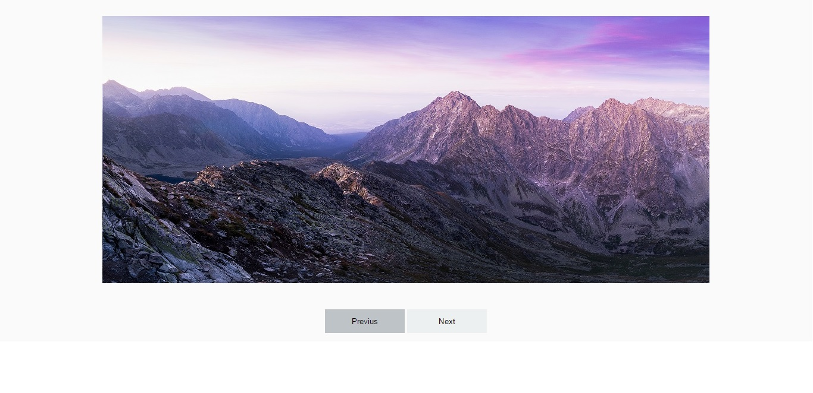

#  Slideshow de imagens
Pequeno projeto, intercalando imagens com Javascript.

## Neste Projeto foram usados:
- HTML 5
- CSS 3
- Javascript

## Confira a demo do projeto:

<ahref="https://thailoeduardo.github.io/slideshow_images/">Demo</a>
